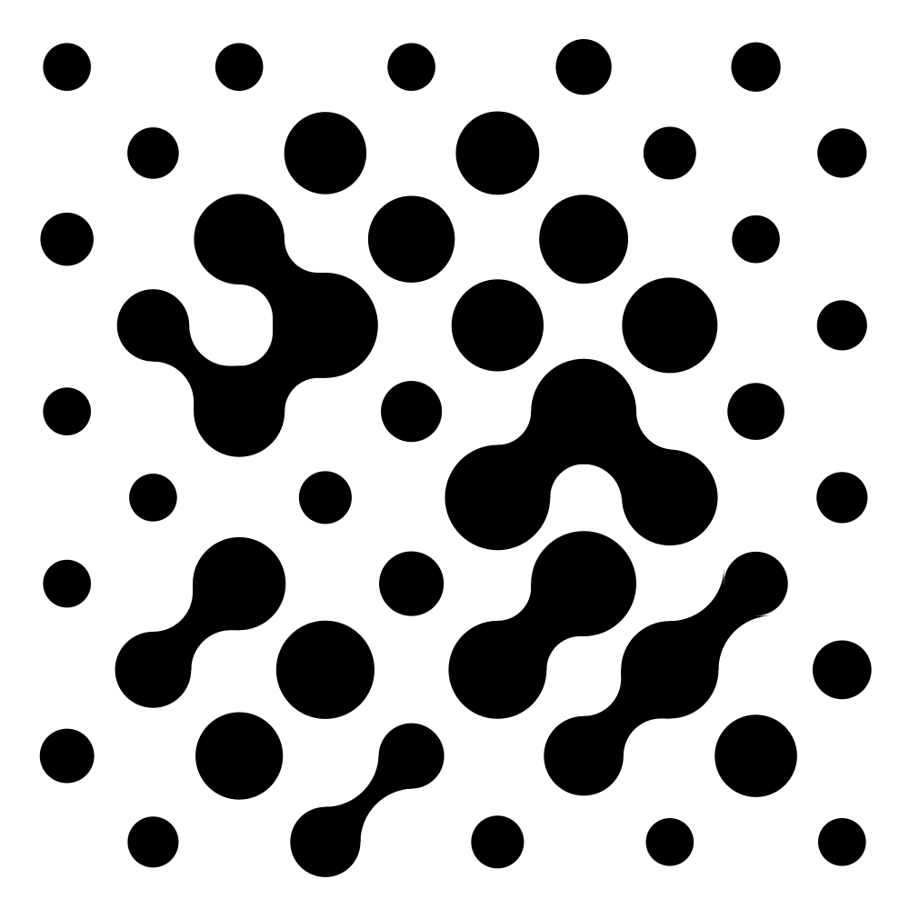
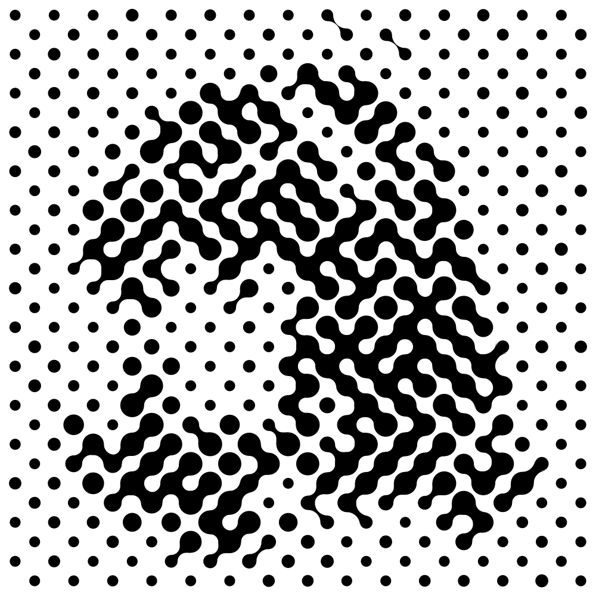
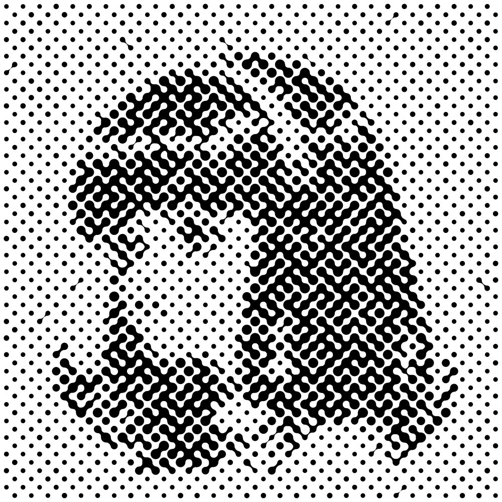

# 👽 Nebulizer Filter

Simple python script to turn png inputs into 'nebulized' svgs.
By Saxon & Hypatia [Qwen3.8, Hermes]

Dark areas of the photo become **big nodes**, light areas become
**small nodes**, and diagonal neighbors are linked by bridges with a
probability derived from the luminance of the gap between them.

## ⚡️ Examples

All three rendered from the same input (`examples/Hermes.jpg`),
default parameters, seed 41 — only the grid resolution changes.

| | 10×10 | 30×30 | 60×60 |
|---|---|---|---|
| nodes | 50 | 450 | 1800 |
| bridges | 10 | 160 | 618 |
| render | |  |  |


## 📦 Install

Simply Download the Python script and run as shown in the 'Usage' section.
Python Dependancies:
-Numpy 
-Pillow

```bash
# Arch
sudo pacman -S python-numpy python-pillow 
# Debian/Ubuntu
sudo apt install python3-numpy python3-pil
```

## 👾 Usage

```bash
python3 nebulizer.py photo.jpg
python3 nebulizer.py photo.jpg --cols 30 --rows 30
python3 nebulizer.py photo.jpg --cols 60 --rows 60 --seed 7
python3 nebulizer.py photo.jpg --stencil off --p-max 0.8
python3 nebulizer.py photo.jpg --out /tmp/my-stencil
```

Output: `stencil.svg` (vector, the real product), `stencil.png`
(full-res preview), `stencil-<time>.png` (small preview).

## ⚙️ Parameters

- `--cols / --rows` — grid size (default 20). Nodes sit on a
  checkerboard (every other cell). If only either is specified, other dimension is caculated of input, to maintain result aspect ratio.
- `--spacing` — grid spacing in SVG units (default 18).
- `--rad-min / --rad-max` — node radius range (default 5–11).
- `--size-noise` — seeded per-node radius jitter, ± (default 1.0).
- `--border-radius` — node corner factor; 1.0 = pure circle (default).
- `--p-min / --p-max` — bridge probability at min/max gap luminance
  (default 0.0–0.5). Linear in luminance, clamped [0, 1].
- `--bridge-noise` — seeded jitter on bridge probability (default 0.10).
- `--gap-half` — half-width (in cells) of the luminance window sampled
  around the shared corner (default 0.5).
- `--stencil on|off` — stencil-safe bridge rules (default on).
- `--stencil-min-skip` — skip bridges between nodes of size stencil-min-skip from the smallest node size. (default 2).
- `--seed` — RNG seed. Deterministic: same image + params + seed =
  byte-identical SVG.

## ❓ How it works

1. Load the image, invert luminance (light → small nodes, dark → big).
2. Place checkerboard nodes; radius = f(cell luminance) + seeded jitter.
3. For each diagonal node pair, sample the gap luminance G, map it to a
   probability `p = p_min + (p_max − p_min)·G + noise`, and roll a
   seeded coin.
4. In stencil mode, reject bridges that violate:
   - **min-size** — a node within `stencil-min-skip` radius-steps of
     the minimum can't bridge;
   - **no-pocket** — a bridge that would close all 4 sides of the
     diamond around a grid corner is rejected, so white always has a
     path to the outside.
5. Emit one `<path>` per node and per bridge into a single SVG.

Bridge geometry is two mirrored quarter-circle cubic Beziers with a
45° centerline cut, decoded from an Illustrator reference
(`examples/reference.svg`) to < 0.1 unit.

### 💊 Stencil guarantee, honestly stated

The no-pocket rule is a **hard guarantee at low-to-mid density**
(≈ up to 20×20 on a typical square portrait): no enclosed white pockets,
verified by pixel flood-fill. At high density (30×30 and up) the node
fills themselves overlap and can seal off *tiny* pockets (a few at
30×30, ~a dozen at 60×60) that the 4-bridge rule can't see. For
physical stencils those are usually harmless — the spray wicks into a
few-pixel gap and the shape stays one island — but know they exist.

## 📃 License

GNU GPL — see [LICENSE](LICENSE).
